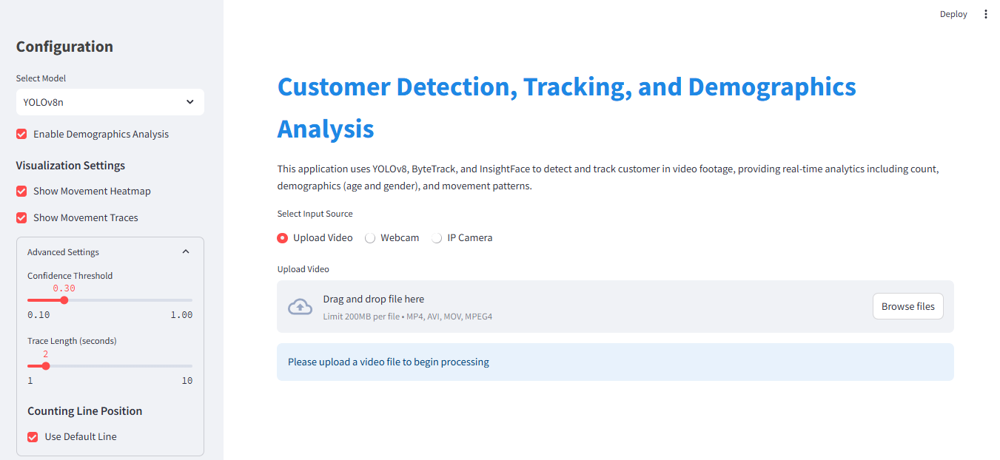

# 🏬📊 Real-Time Customer Tracking with Demographics Insights 

### Advanced Computer Vision System for Real-Time Customer Tracking and Demographic Insights

[](https://opensource.org/licenses/MIT)
[](https://www.python.org/)
[](https://pytorch.org/)
[](https://streamlit.io/)


</div>


## ✨ Features

### 🔍 Core Capabilities
| Component | Description | Technology Stack |
|-----------|-------------|------------------|
| **Customer Detection** | Real-time detection with configurable models | YOLOv8 • OpenCV |
| **Multi-Object Tracking** | Robust cross-camera tracking | ByteTrack • Supervision |
| **Demographics Analysis** | Age & gender estimation | InsightFace • Deep Learning |
| **Spatial Analytics** | Movement patterns & heatmaps | OpenCV • NumPy • SciPy |
| **Zone-Based Analytics** | Define custom zones for targeted analysis | OpenCV • NumPy |

### 📈 Web Interface Highlights
- 🎚 Multi-source input (Webcam/IP/Video)
- 📊 Real-time analytics dashboard
- 🔄 Interactive visualization controls
- 🧮 Demographic distribution charts
- 🌋 Movement heatmap overlay
- 📍 Object trajectory tracing
- 🔲 Custom zone definition for targeted analytics

## 🖥️ Interface Previews




## 🚀 Quick Start

### ⚙️ Prerequisites
- Python 3.9+ • CUDA 11.7+ • NVIDIA GPU (Recommended)

### 🛠 Installation
```bash
# Clone repository
git clone https://github.com/hafizshakeel/Real-Time-Customer-Tracking-with-Demographics-Insights
cd Real-Time-Customer-Tracking-with-Demographics-Insights

# Install dependencies
pip install -r requirements.txt
```

### 🖥 Running the Application
```bash
# Web Interface (Streamlit)
streamlit run app.py

# CLI Processing (Video Example)
python run.py --source_video_path input.mp4 --demographics --show_heatmap

# Real-time Webcam
python -m customer_tracker --source_video_path 0 --demographics

# Zone-based Analytics
python zone.py
```

## 🧩 Project Structure
```bash
CUSTOMER-TRACKING/
├── 📂 customer_tracker/       # Core detection & tracking logic
│   ├── 📂 core/            # Algorithm implementations
│   │   ├── 📄 detector.py  # Customer detection module
│   │   ├── 📄 tracker.py   # Object tracking implementation
│   │   ├── 📄 counter.py   # Occupancy counting logic
│   │   └── 📄 demographics.py # Age/gender analysis
│   ├── 📂 visualization/   # Visualization components
│   │   └── 📄 annotator.py # Frame annotation utilities
│   ├── 📂 utils/           # Utility functions
│   └── 📂 config/          # Configuration files
├── 📂 customer_vision/        # Model training pipeline
│   ├── 📂 pipeline/        # Training workflow
│   ├── 📂 components/      # Pipeline components
│   ├── 📂 entity/          # Configuration schemas
│   └── 📂 utils/           # Training utilities
├── 📄 app.py               # Streamlit web interface
├── 📄 zone.py              # Zone-based analytics tool
├── 📄 train.py             # Model training script
└── 📄 requirements.txt     # Dependency management
```

## ⚙️ Configuration

### 🔧 Key Settings
| Component | Options | Default |
|-----------|---------|---------|
| **Detection** | Model Size (n/s/m/l/x) | YOLOv8s |
| | Confidence Threshold | 0.3 |
| **Tracking** | Algorithm | ByteTrack |
| | History Length | 30 frames |
| **Demographics** | Age Groups | [0-18, 19-35, 36-60, 60+] |
| | Face Detection Confidence | 0.5 |
| **Zone Analytics** | Grid Size | 16px (adjustable) |
| | Zone Opacity | 0.2 |

```python
# Example configuration override
from customer_tracker.config import settings

settings.MODEL_SIZE = 'm'  # Medium model for better accuracy
settings.DEMOGRAPHICS_ENABLED = True
```

## 📊 Analytics Dashboard
The Streamlit-based dashboard provides comprehensive analytics including:

**Key Metrics:**
- Real-time occupancy count
- Demographic distribution pie charts
- Movement heatmap overlay
- Historical traffic patterns
- System performance metrics
- Zone-based occupancy statistics

## ☁️ Deployment

### 🐳 Docker Setup
```bash
# Build image
docker build -t customervision .

# Run container
docker run -p 8501:8501 customervision
```

### AWS EC2 Deployment
<details>
<summary><strong>🔐 IAM Configuration</strong></summary>

1. Create IAM user with:
   - `AmazonEC2ContainerRegistryFullAccess`
   - `AmazonEC2FullAccess`
2. Store credentials in GitHub Secrets:
   ```env
   AWS_ACCESS_KEY_ID=your_key
   AWS_SECRET_ACCESS_KEY=your_secret
   AWS_REGION=us-east-1
   ```
</details>

<details>
<summary><strong>📦 ECR Setup</strong></summary>

```bash
aws ecr create-repository --repository-name vehicle-tracking --region us-east-1
aws ecr get-login-password | docker login --username AWS --password-stdin your-account-id.dkr.ecr.us-east-1.amazonaws.com
```
</details>

<details>
<summary><strong>🖥 EC2 Configuration</strong></summary>

```bash
# Install Docker on Ubuntu
sudo apt-get update && sudo apt-get upgrade -y
curl -fsSL https://get.docker.com -o get-docker.sh
sudo sh get-docker.sh
sudo usermod -aG docker ubuntu
newgrp docker
```
</details>

## 📈 Future Roadmap
- 🌐 Multi-camera synchronization
- 🧠 On-device TensorRT optimization
- 🔐 Privacy-preserving blur filter
- 📈 Advanced behavioral analytics
- 🔄 Real-time API for integration with other systems


## 🙏 Acknowledgments
- [YOLOv8](https://github.com/ultralytics/ultralytics) - State-of-the-art object detection
- [ByteTrack](https://github.com/ifzhang/ByteTrack) - Multi-object tracking
- [InsightFace](https://github.com/deepinsight/insightface) - Demographics analysis
- [Streamlit](https://streamlit.io/) - Web interface framework
- [Supervision](https://github.com/roboflow/supervision) - Computer vision utilities
- Special thanks to the open-source community!


## 📜 License
Distributed under the MIT License. See `LICENSE` for more information.

📩 **Need professional support?** [Contact me](mailto:hafizshakeel1997@gmail.com) for assistance.  
